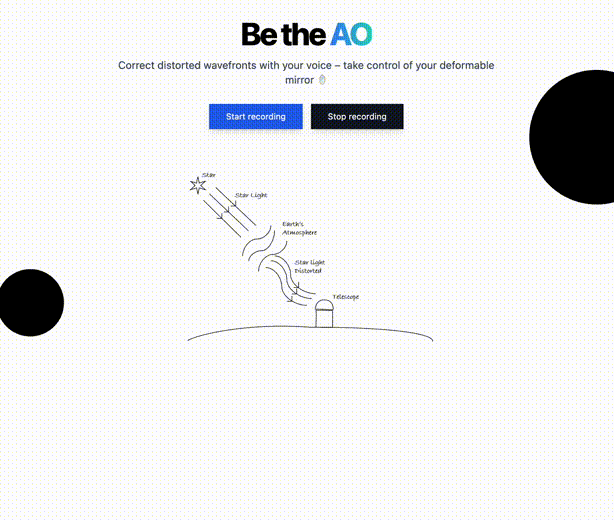

# Be the AO

Use your voice to control an Adaptive Optics (AO) system.

Built during the [NYRIA](https://nyriastronomy.github.io/index.html) 2023 workshop in Marseille, France.

Authors: Radhika Dharmadhikari, Arseniy Kuznetsov, Peter Pihlmann Pedersen, Jake Pember, Muskan Shinde



## Installation

```
git clone https://github.com/ppp-one/nyria-hackathon-2023.git
cd nyria-hackathon-2023
conda env create -f environment.yml
```

## Usage

```
python main.py
```
